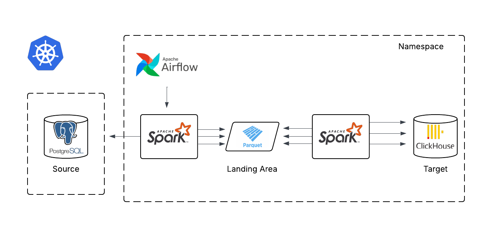

# Batch ETL Pipeline on Kubernetes
Skeleton of a simple batch ETL using Spark to transform and load data into a ClickHouse data warehouse, with Airflow for orchestration. Run on Kubernetes using ```KubernetesPodOperator```.



## Data Flow Architecture
### Ingestion
- Airflow triggers the ```KubernetesPodOperator``` at a given schedule (e.g. ```0 0 * * *```), starting up a spark driver pod with the ```Dockerfile.Spark``` image. Spark connects to source (PostgreSQL) with JDBC to retrieve data based on a ```last_extracted_time``` bookmark.
- Preliminary filters are executed. In my case, the data had some date value before ```1970-01-01```, so I had to convert those to ```NULL``` before writing. Deleted rows can also be filtered at ```transform_config.yaml```.
- Spark writes the data as partitioned .parquet files into a staging volume.

### Transformation
- Depending on the table, spark performs transformations such as typecasting, joins, further filters, etc.
- Calculation validations are carried out as well; in my case, it was making sure all transaction items sum up to the transaction value.
- Since warehouses are schema-on-write, ```transform_config.yaml``` acts as a centralized (one file) schema registry (inefficient!).
- Spark connects to ClickHouse using the connector. ```CREATE TABLE``` and ```INSERT INTO``` are the commands. Used to load data into a processed layer in ClickHouse.

### Load
- Loading from the processed (```clean```) layer into the curated (warehouse) layer.
- Bookmarks are saved as metadata in another table ```metadata.etl_bookmark```. Edit: In this version, it is called ```etl_metadata.cdc_state```. 

## Infrastructure & Deployment
- ```Dockerfile.Airflow``` and ```Dockerfile.Spark``` are the two images used here.
- CI pipeline can be viewed from ```bitbucket-pipelines.yaml```.

### Orchestration
- As mentioned, Airflow is responsible for orchestrating the DAGs. There are 2 types of ETL that are orchestrated, one for tables that are not up-to-date in the warehouse (backfill), and another one for those that are (incremental). These are indicated by the Boolean column ```backfill``` in ```metadata.etl_bookmark```.
- There are 3 different scripts for the logistics; ```extractor.py```, ```transformer.py```, and ```loader.py```. 2 scripts for the types of ETL; ```run_backfill.py``` and ```run_incremental.py```. And 2 DAGs that run those 2 types; ```backfill_dag.py``` and ```incremental_dag.py```.

### Resources
- Resources are managed in the DAGs, specifically in the ```spark-submit``` configurations, i.e. the number of driver cores, executor cores, etc.
- Reserved resources are declared in the multiple ```deployment.yaml``` files.

## Configurations
### Airflow
- Airflow is configured to read the DAGs from the default ```/opt/airflow/dags```.
- Connections and env variables are declared in the ```configmap.yaml```, while secrets are kept in ```secrets.yaml```.

### ClickHouse
- A copy of ClickHouse's ```config.xml``` and ```users.xml``` is available here. The contents were copied to the ```deployment.yaml```.
- Simple configs were ```users```, ```profiles```, ```max_memory_usage```, ```max_threads```, ```quotas```, ```grants``` and more.

## Key Features
- Incremental & Backfill Logic: Automated switching based on metadata state.
- Schema Enforcement: Centralized yaml registry to prevent downstream breakage.
- Scalable Compute: Leveraging Spark-on-K8s for ephemeral, high-throughput processing.

## Key Challenges & Decisions
- For cost and adaptability preferences, I mainly chose open-source technologies. 
- Warehouses are typically used for big aggregates and analytics, therefore ClickHouse is a good choice. It has superior OLAP performance and can scale up to multiple shards if needed.
- Spark is used because it is the bread and butter of big data processing, and having experience configuring it was great for learning.
- Airflow is also an industry-standard workflow orchestrator, now I know the difference between ```@task``` and operators!
- Kubernetes for overall container management and orchestration.

## Disclaimer
This was my first ever ETL solution, so pardon the inefficiencies and naiveties. What I would change/fix now:
- Turn into ELT (given the warehouse resources are larger and more scalable).
- Add a custom "crawler" (really just spark's infer schema) to save metadata to a metadata store.
- Add datasets from third parties to enrich data.
- Choose more optimized data types.
- Stream logs to a metric visualizer (absolutely overkill but cool!).
- Increase modularity of metadata config and DAG tasks.
- Implemented log-based CDC instead of naive query-based CDC.
- Better ways of handling schema evolution. 
