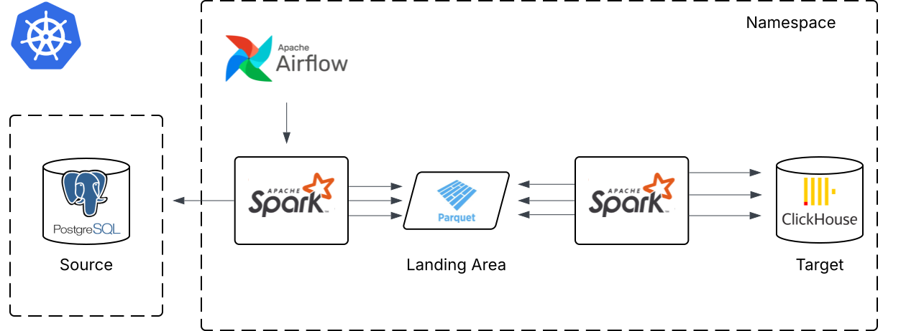

# etl-k8s-spark-airflow
Skeleton of an ETL pipeline, using Spark to extract, transform, and load data into a Clickhouse data warehouse, with Airflow for DAG orchestration. Run on Kubernetes using KubernetesPodOperator.

Data source: postgresql

Airflow triggers orchestration every midnight, launches driver and 5 executor instances as pods with spark image.

Spark reads new data based on bookmark, transforms and loads to staging area (volume).

Transforms and loads into clean area.

COPY from clean to curated (warehouse).

Data warehouse: clickhouse

Notes: This was my first ever ETL solution, so there are a lot of inefficient steps. 
What I would change/fix now:
- Turn into ELT (given the warehouse resources are larger and more scalable).
- Add a custom "crawler" (really just spark's infer schema) to save metadata to a metadata store.
- Add datasets from third parties to enrich data.
- Stream logs to a metric visualizer (absolutely overkill but cool!).
- Increase modularity of metadata config and DAG tasks.
